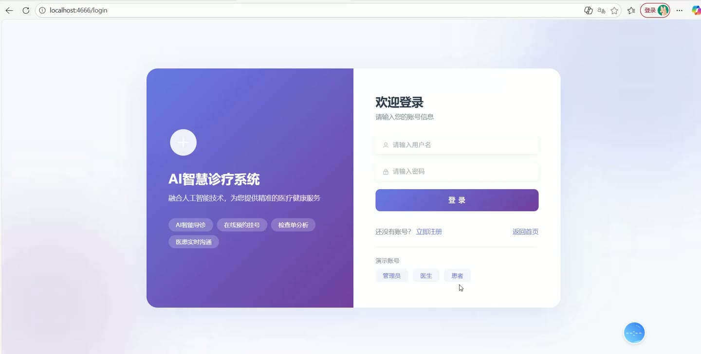
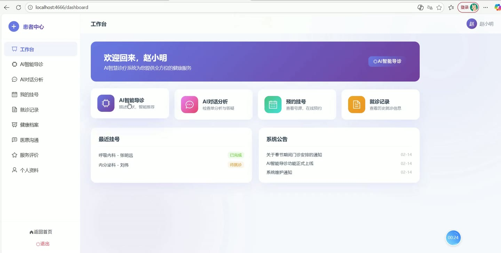
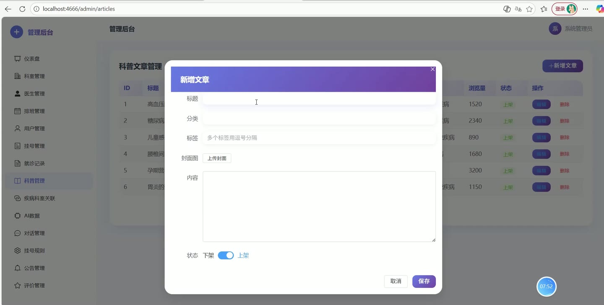
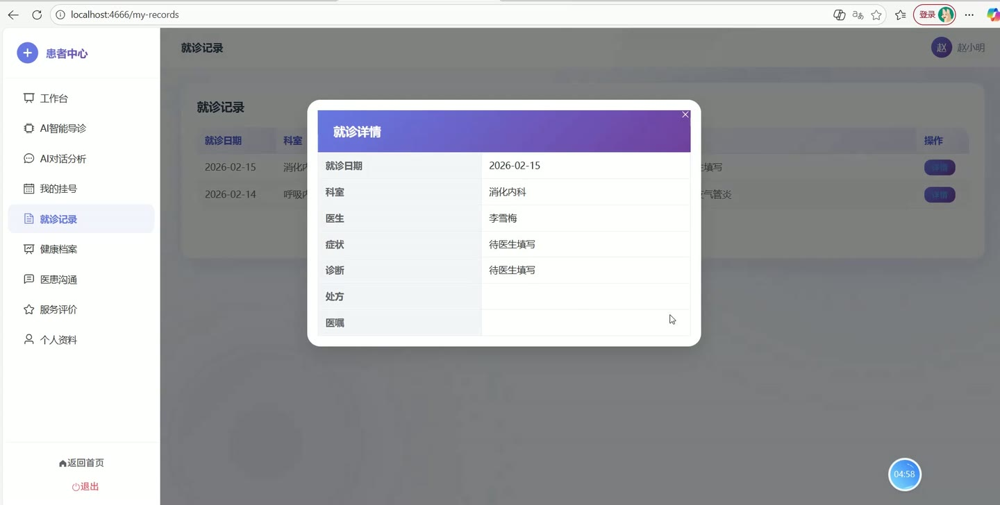
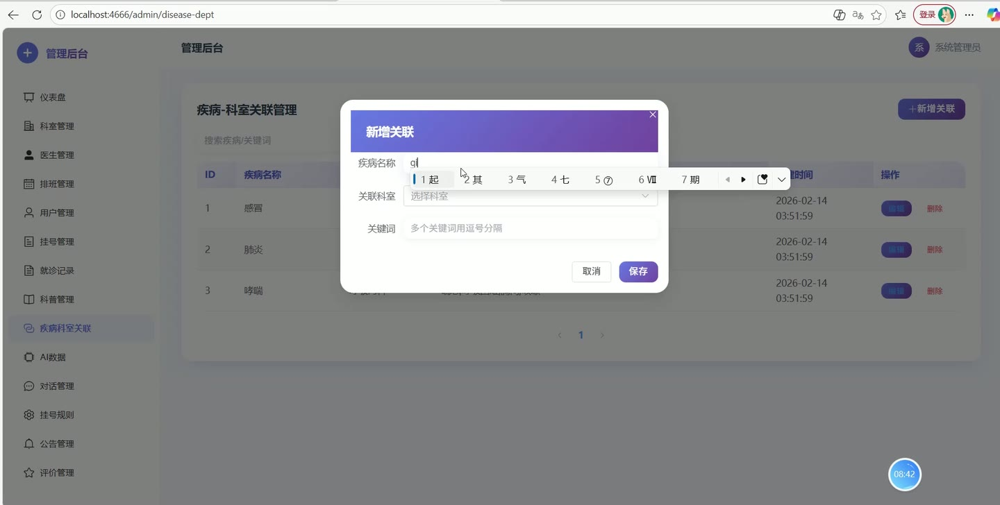
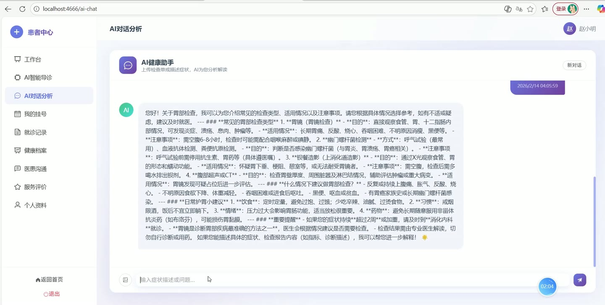

# (附文档)Springboot3+Vue3+MySQL AI辅助智慧诊疗系统

**技术栈**：Springboot3、Vue3、MySQL

### 系统简介

本系统是一套基于 Spring Boot 3 + Vue 3 + MySQL 的前后端分离智慧诊疗平台，覆盖患者端、医生端、管理端三大角色。患者可在线预约挂号、查看就诊记录、使用 AI 辅助症状诊断与报告分析、与医生在线沟通；医生可管理排班、处理预约、书写病历；管理员可管理用户、科室、医生信息、公告、敏感词及系统统计数据。
 
### 核心功能
 
### 患者端

 
- AI 症状诊断：输入症状文字，调用大模型 API 分析可能病因，自动匹配推荐科室与医生，生成诊断记录。 
- AI 检查单分析：上传检查单图片并输入描述，AI 分析异常指标并给出就医建议。 
- AI 健康对话：与 AI 医疗助手进行多轮对话，支持图片上传，系统自动携带最近 10 条上下文。 
- 查看诊断历史：分页查看个人 AI 诊断记录，支持按诊断类型（症状诊断/报告分析）筛选。 
- 管理 AI 对话会话：查看所有会话列表（显示最后一条消息摘要），查看单条会话完整历史。 
- 在线预约挂号：选择科室、医生、可用排班时段，填写预约信息并提交，系统自动生成订单号。 
- 查看我的预约：分页查看个人预约列表，支持按状态、科室、医生、日期范围筛选。 
- 取消预约：对“待就诊”状态的预约执行取消操作，自动释放号源。 
- 查看就诊记录：分页查看个人就诊病历，包含症状、诊断、处方等字段。 
- 医生在线聊天：与医生进行一对一实时文字沟通，支持 WebSocket 推送新消息。 
- 医生评价：对就诊过的医生提交评分与评价内容。 
- 浏览健康科普：查看已发布的疾病科普文章，支持按分类与关键词搜索。 
- 查看公告：浏览面向患者角色的系统公告。 
- 个人信息管理：查看和修改个人资料（用户名、真实姓名、手机号、密码等）。
 
### 医生端

 
- 查看个人排班：按日期查看自己的排班列表，支持导出 CSV 格式排班报表。 
- 管理排班：新增/编辑/删除排班，系统自动检测同一医生同一日期时段是否冲突。 
- 处理预约：查看患者对自己的预约，支持修改预约状态（完成就诊/取消等）。 
- 书写病历：为已完成就诊的患者填写或编辑病历（症状、诊断、处方等）。 
- 患者在线聊天：与患者进行一对一实时沟通，支持标记消息已读。 
- 查看患者评价：查看患者对自己的评价列表。
 
### 管理端

 
- 用户管理：分页查看所有用户，支持按关键词/角色筛选，可启用/禁用用户账号，重置用户密码为 123456。 
- 医生信息管理：新增/编辑/删除医生信息，关联用户账号与科室。 
- 科室管理：维护科室树形结构，支持新增/编辑/删除科室，设置排序与状态。 
- 疾病-科室对照管理：配置疾病名称、关联科室与关键词，用于 AI 诊断时匹配推荐科室。 
- 排班管理：查看所有医生排班，支持按医生/日期筛选，可批量导入 CSV 排班文件。 
- 预约管理：查看所有预约订单，支持按用户/医生/状态筛选。 
- 就诊记录管理：查看所有病历记录，支持按患者/医生/科室筛选。 
- 公告管理：发布/编辑/删除系统公告，可设置目标角色（ALL/USER/DOCTOR）。 
- 健康科普管理：发布/编辑/删除疾病科普文章，支持设置分类、标签、状态。 
- 敏感词管理：查看、新增、删除敏感词，聊天消息发送时自动过滤替换为 *。 
- 系统数据统计：查看总用户数、医生数、预约数、病历数、AI 诊断数、AI 对话数等概览数据。 
- AI 诊断统计：按诊断类型（症状/报告）统计数量。 
- 聊天统计：查看总聊天消息数、AI 对话数、用户/助手消息数。 
- 预约规则配置：查看和修改全局预约规则。 
- 补充缺失就诊记录：一键为已完成但缺少病历的预约自动创建空白病历。
 
### 技术栈

 后端框架Spring Boot 3 ORMMyBatis-Plus 权限认证JWT（自定义拦截器 + Token 解析） 前端框架Vue 3 状态管理Vuex / Pinia 构建工具Vite 数据库MySQL 实时通信WebSocket（STOMP） AI 接口大模型 API（可配置 API Key、URL、模型、最大 Token、温度） 文件上传本地文件存储（可配置上传路径） 工具库Hutool（加密、HTTP 调用、JSON 处理）
 
### 交付内容

 
- 后端完整源码 
- 前端完整源码 
- 数据库初始化脚本 
- 万字文档

## 界面展示

---

## 获取完整源码 + 万字文档

本仓库为项目介绍页。**完整前后端源码、数据库初始化脚本、万字项目文档**，请加微信 `kangkangcode`，或访问 [codekk.top](http://codekk.top) 获取。

可作课程设计 / 毕业设计参考，支持远程部署调试。